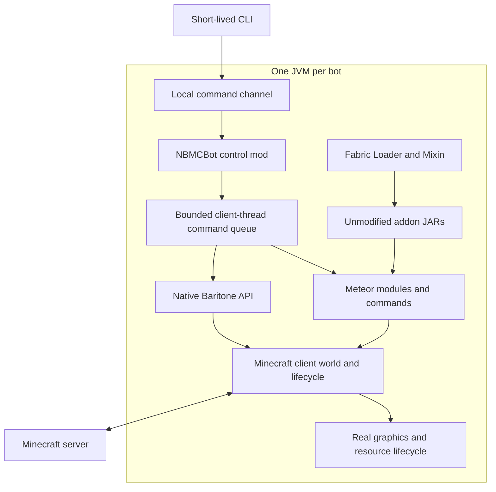

# NBMCBot: native compatibility under a 256 MB memory requirement

Date: 2026-10-04
Status: Historical proposal, superseded by [the unrestricted rewrite design](2026-10-04-nbmcbot-rewrite-design.md).

The requirements below record the earlier unchanged-JAR constraint. The user
subsequently allowed unrestricted code changes, including addon migration.
The linked rewrite design is now the active proposal. Neither design has
implementation or benchmark results.

## 1. Requirements and decision

The user requires all three properties:

1. A Minecraft bot with the full functionality of Meteor and Baritone.
2. Existing Meteor addon JARs run without source changes or repackaging.
3. Total memory attributable to one running bot never exceeds 256 MB RSS.

Use 256,000,000 bytes as the conservative interpretation of 256 MB. Startup,
login, reconnect, dimension changes, resource reloads, and active tasks count.
The budget covers supporting processes required to operate that bot, not just
the Java heap. No remote worker, swap, or excluded renderer may hide the cost.

These are requirements, not demonstrated properties. The defensible candidate
is a native Minecraft/Fabric runtime with Meteor, Baritone, and a small bot
control mod. Its ability to satisfy the memory limit is unknown and is the
first experimental gate. Do not describe this proposal as a proven 256 MB bot.

An unrestricted guarantee for every addon and workload is not possible: an
otherwise loadable addon may itself allocate more than the entire budget.
For a testable delivery contract, specify a Minecraft version, dependency
versions, addon hashes, configurations, and workloads. This makes compatibility
claims reproducible; it does not authorize removing requested functionality.

## 2. Evidence

The upstream sources inspected for this design establish dependency structure,
not memory measurements:

- [Meteor AddonManager](https://github.com/MeteorDevelopment/meteor-client/blob/master/src/main/java/meteordevelopment/meteorclient/addons/AddonManager.java)
  discovers addons through Fabric's `meteor` entrypoint.
- [The official addon manifest](https://github.com/MeteorDevelopment/meteor-addon-template/blob/master/src/main/resources/fabric.mod.json)
  declares a client environment, Minecraft dependency, and Mixin configuration.
- [MeteorClient](https://github.com/MeteorDevelopment/meteor-client/blob/master/src/main/java/meteordevelopment/meteorclient/MeteorClient.java)
  holds a global Minecraft client reference and initializes addon callbacks,
  systems, configuration, and GUI integration.
- [Meteor's Baritone fork, IPlayerContext](https://github.com/MeteorDevelopment/baritone/blob/26.2/src/api/java/baritone/api/utils/IPlayerContext.java)
  exposes Minecraft, LocalPlayer, world, entities, and crosshair state.
- [Meteor's version catalog](https://github.com/MeteorDevelopment/meteor-client/blob/master/gradle/libs.versions.toml)
  currently lists Minecraft 26.2, JDK 25, and a Meteor-maintained Baritone
  dependency. This is a research snapshot, not a certified release combination.

Pin immutable versions and hashes before implementation. Do not substitute
the current default branches for a verified addon-compatible combination.

## 3. Architecture choices

| Approach | Existing addon JARs | Full upstream behavior | 256 MB assessment |
| --- | --- | --- | --- |
| Native Minecraft + Fabric + Meteor + Baritone | Preserves the real loading environment; version and conflict tests still required | Best candidate for preserving semantics | Unproven; must pass measurement first |
| Rust protocol client with reimplemented modules | No native Meteor/Fabric compatibility | A new implementation requiring extensive parity work | Plausible optimization direction, but fails the user's addon requirement |
| Small bot with an external Java compatibility host | Only within the host's real runtime | Depends on the host | Host memory still counts; no solution to the total budget |

Select the first approach for feasibility validation. A partial Java API shim,
class-name emulation, or translating JARs to WebAssembly does not establish
Minecraft, Mixin, rendering, reflection, or event-order compatibility.

## 4. Runtime layout

Responsibilities:

- **Launcher:** validate the pinned installation, start one JVM, collect exit
  status and memory telemetry. A resident supervisor counts toward the budget.
  Multiple independent bots use separate JVMs initially because upstream
  global client and module state is not a supported multi-session boundary.
- **Control mod:** execute commands on the existing client thread. Expose
  module enumeration, toggle/settings operations, native commands, Baritone
  goals and cancellation, connection state, and bounded telemetry. Reuse
  upstream objects instead of copying the world into a second model.
- **Addon loading:** place original files in the normal Fabric mod installation.
  Preserve metadata, dependency resolution, Mixin application, initialization
  order, Meteor registration, settings, and events. Install/update at process
  restart; do not promise hot unloading of classes or Mixins.
- **Graphics:** retain a valid graphics context and upstream rendering lifecycle.
  A hidden window is a deployment option, not a memory optimization guarantee.
  Visual modules, HUDs, GUI panels, shaders, and render-event addons remain
  functional requirements. Fake rendering callbacks do not satisfy them.
- **Automation:** layer task sequencing over real Meteor and Baritone controls.
  The bridge arbitrates only operations it owns; arbitrary addons can bypass
  it. Conflicting upstream modules require explicit configuration and testing.

The local control interface returns request IDs and explicit outcomes:
accepted, completed, invalid configuration, addon conflict, task failed, or
resource exhausted. Receiving a command is not proof its world action succeeded.
Queued work is invalidated on disconnect or world replacement. Memory-pressure
handling must not silently disable modules and claim full functionality.

## 5. Memory strategy

Measure the real distribution before choosing heap limits:

`RSS ~= resident heap + metadata/JIT + thread stacks + native buffers + graphics/native libraries + other resident mappings`

`-Xmx256m` limits neither this sum nor the full process tree. A small heap can
increase collection pressure without meeting the RSS target. Do not publish a
fabricated minimum footprint or a heap budget whose native component is unknown.

Apply one change at a time, in this order:

1. Keep the bridge small: no embedded browser UI, extra application framework,
   replicated world, unbounded packet history, or unbounded command queue.
2. Bound bridge buffers, logs, status retention, and connection retry state.
   This controls bridge allocations, not arbitrary addon allocations.
3. Profile upstream world, model, texture, pathfinding, cache, and native memory.
   Reclaim only data whose ownership and lifetime are understood.
4. Tune JVM heap sizing and collector choice against the measured workload.
   Include latency, allocation rate, and task success in comparisons.
5. Evaluate smaller view distance, rendering rate, cache size, and search
   budgets as explicit configuration experiments. They may affect perception,
   render callbacks, path completion, or addon behavior; they are not certified
   optimizations until the corresponding behavior tests pass.
6. Consider narrowly scoped patches only after profiling identifies a material
   cause. Preserve addon-visible class/method contracts and observable behavior.

Retain Minecraft's normal client tick cadence and network processing. Reducing
graphics work must not accidentally throttle simulation. Removing textures,
models, entities, render events, or complex pathfinding is a feature reduction
when a required module uses them.

A hard OS memory limit is a containment mechanism. An OOM kill or refused task
is a failed workload, even if the resource limiter functioned correctly.
Admission checks can reject known incompatible configurations, but cannot
predict all future allocations of arbitrary native Java addons.

## 6. Compatibility contract

Compatibility is established against an unmodified reference installation of
the same versions and addon set:

- Addon input JAR SHA-256 hashes remain unchanged.
- Fabric dependency resolution and Mixin application complete successfully.
- Module, command, setting, and HUD registration matches the reference.
- Required callbacks execute with the expected state and event order.
- Actual gameplay and visual effects match their acceptance cases.
- Configuration persistence, reconnect, world changes, and shutdown work.

Full functionality means all required functions remain available, including
visual ones. It does not mean mutually exclusive modules must be enabled
simultaneously. Enumerate the complete module and Baritone feature inventory
for the pinned release; a few successful smoke tests do not establish parity.
The official example addon is a loader smoke test, not proof that third-party
addons work. New addon sets require renewed compatibility and memory tests.

## 7. Validation and stop conditions

Prefer a reproducible Linux validation target for whole-process accounting;
the local macOS workspace does not establish the eventual deployment platform.
Report OS, architecture, JDK, graphics backend, world fixture, server settings,
view distance, module configuration, and exact artifact hashes.

Test stages:

1. **Baseline:** launch the normal pinned Minecraft/Fabric installation,
   then Meteor, then its compatible Baritone build, then the example addon,
   then required third-party addons. Measure cold startup and online steady
   state at each stage. This identifies whether the budget is already exceeded
   before NBMCBot-specific functionality is introduced.
2. **Control proof:** login, accept a command, execute a short Baritone task,
   observe the server-side result, save configuration, and reconnect.
3. **Parity:** exercise the release's feature inventory and user-required addon
   workflows, including rendering-dependent behavior. Use resettable worlds
   and compare outcomes with the reference installation.
4. **Pressure:** exercise long paths, dense entities, chunk streaming, building,
   inventory operations, dimension transitions, resource reloads, and reconnect
   loops. Vary one workload parameter at a time.
5. **Soak:** run the accepted workload mix for 24 hours with no task failures,
   no process restarts masking leaks, and no upward memory trend after warmup.

Record aggregate bot process-tree RSS and peaks, latency, task outcomes,
collection activity, native allocation evidence, and any OS resource events.
Periodic RSS samples alone can miss short peaks. Use available high-water
counters and retain measurement uncertainty explicitly.

On Linux, cgroup v2 `memory.current`, `memory.peak`, `memory.events`,
`memory.max`, and swap controls provide additional whole-group evidence.
Cgroup accounting includes charges beyond RSS and is not an interchangeable
RSS measurement. Count display helpers if the bot requires them. A container
limit cannot make an incompatible workload complete successfully.

HotSpot Native Memory Tracking assists attribution but excludes some
third-party native allocations and adds overhead. Use separate diagnostic
runs and acceptance runs; do not subtract unexplained memory from the result.
GPU allocations must be disclosed separately, particularly on shared-memory
hardware; do not move required work to an unreported graphics process.

Stop or reject the candidate if any required workload exceeds the budget,
fails, loses an upstream feature, requires editing an addon, or relies on
unaccounted helper memory. Optimize and retest where evidence supports it.
If the candidate still fails, report that no validated design satisfies the
requirements. Changing the memory limit or compatibility requirement is a
user decision, not an implicit fallback.

## 8. Delivery sequence

1. Produce a reproducible baseline feasibility report before building a large
   bot framework. Required inputs are target Minecraft version, deployment
   platform, required addon names/versions, and representative tasks.
2. If a measured compatible baseline has sufficient memory headroom, implement
   the small control mod and its single end-to-end task.
3. Add required automation and full feature coverage, repeating the combined
   memory and compatibility gate after each material change.
4. Deliver pinned launch files, addon compatibility results, reproducible
   workload fixtures, and memory traces together with the bot.

Current result: architecture and validation method are specified. No binary
has been built, no addon has been tested, and no 256 MB result has been measured.

Additional measurement references:

- [Oracle: Native Memory Tracking](https://docs.oracle.com/en/java/javase/25/vm/native-memory-tracking.html)
- [Linux kernel: cgroup v2](https://docs.kernel.org/admin-guide/cgroup-v2.html)
