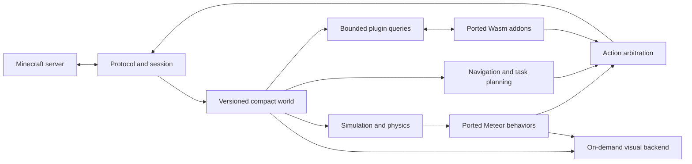

# NBMCBot: unrestricted rewrite for a 256 MB target

Date: 2026-10-04
Status: Runtime milestone implemented for Minecraft 1.21.11. See ../../FEATURES.md
and ../../VALIDATION.md for implemented behavior and measured evidence. Full parity
and the unrestricted 256 MB acceptance contract remain incomplete.
Supersedes: [the native compatibility proposal](2026-10-04-nbmcbot-design.md).

## 1. Updated contract

The user now permits unrestricted code changes. Interpret this in the context
of the preceding question as permission to rewrite the bot, modify upstream
implementations, and migrate/recompile Meteor addons. Unmodified JAR loading
is no longer the architectural constraint. The 256 MB total RSS requirement
and the full-functionality goal remain.

Recommend a Rust runtime with a compact authoritative world store, ported
Meteor behaviors, a Baritone-derived navigation implementation, and explicitly
ported WebAssembly addons. This removes the requirement to host the original
Minecraft/Fabric/JVM environment. It does not automatically establish feature
parity or prove the memory target.

Use 256,000,000 bytes as the conservative interpretation of 256 MB. All required
processes, startup and runtime peaks count. Required rendering or compatibility
work cannot be outsourced to an unaccounted process. A workload that exceeds
the budget or cannot complete because of quotas fails acceptance.

## 2. Alternatives and choice

| Approach | Advantage | Main cost | Decision |
| --- | --- | --- | --- |
| Rust core and source-level behavior/addon ports | Explicit ownership and bounded data structures; no original client runtime requirement | Significant feature and addon migration work | Recommended |
| Deep Java client fork | More upstream behavior can be reused directly | Persistent client/native dependencies and Mixin coupling; uncertain footprint | Retain as reference or alternative if measurements justify it |
| Unmodified JARs in a separate host | Preserves the original addon environment | Host memory still counts | Does not address the total budget |

The recommendation is an engineering inference based on the relaxed
compatibility requirement, not a measured comparison.

## 3. Components and data flow

- **Protocol/session:** authentication, encryption/compression, packet codecs,
  connection state, inventory transactions, and reconnection. Start with one
  pinned Minecraft Java version. Version expansion is a separate compatibility
  task rather than an automatic side effect of a proxy.
- **World/physics:** one authoritative client view shared by modules, plugins,
  navigation, and rendering. Preserve relevant server updates, collision,
  movement, inventory, and prediction/reconciliation behavior.
- **Module system:** port Meteor settings, commands, event-dependent behavior,
  configuration persistence, and tasks. Built-in hot paths use native Rust.
  Feature presence in a menu is not functional parity.
- **Navigation:** reproduce the pinned Baritone feature inventory, including
  movement primitives, goals, mining/building, replanning, cancellation, and
  failure handling. A basic A* implementation is not a replacement for all of
  Baritone. Match externally observable task behavior, not Java object layout.
- **Plugin runtime:** source-level addon ports call a versioned host API and
  produce bounded action requests. Retain module concepts where useful while
  replacing direct Minecraft access and Mixins with explicit hooks.
- **Visual backend:** render GUI, HUD, overlays, and any required world effects
  through a lightweight backend sharing the same world data. Allocate resources
  on demand and reclaim them at defined lifecycle boundaries.

The main simulation owns world mutation. Network decoding hands off bounded
updates; planning uses versioned reads with bounded snapshot retention.
Disconnects and dimension changes invalidate queued work and stale handles.
Action arbitration resolves competing movement, rotation, inventory, and
interaction requests with explicit ownership and cancellation semantics.
Record rejected/conflicting requests instead of silently changing behavior.

Candidate foundations are selected Azalea crates for protocol, authentication,
and physics. Its official documentation notes unfinished features and breaking
changes, so it is not evidence of complete Minecraft or Baritone support.
Evaluate the normal client path first and fork only where profiling identifies
necessary changes. Do not retain both Azalea's world representation and a full
duplicate custom world in the final runtime.

Source: [Azalea](https://github.com/azalea-rs/azalea).

## 4. Bounded world and pathfinding memory

Store block sections with palettes and packed state indices. Use compact
entity records and lazily decode retained metadata when needed. Account for
palette expansion and temporary decode buffers as well as steady-state data.
Do not hardcode world height or discard metadata required by a supported module.

Separate data lifetimes:

1. **Active:** exact current states needed for collision, interaction, enabled
   modules, and near-term path execution. These are pinned by dependency.
2. **Cached:** previously observed sections and navigation summaries with
   server identity, dimension, and world/session version information.
3. **Persistent:** bounded compressed disk history read in limited windows.
   Resident file mappings and cache effects remain visible in measurements.

Eviction must not turn a block into air or turn stale data into current data.
For still-subscribed but evicted sections, either retain sufficient bounded
updates or mark the section unknown until a valid reconstruction is available.
Do not assume the server will resend a full chunk on demand. Unknown data
causes exploration, replanning, or an explicit task failure.

Use indexed arenas for search nodes and bounded collections for frontiers and
visited states. Employ segmented planning and validate the next segment
against current world state. Node quotas, time slicing, and cache eviction can
change completeness and latency; test these effects against the reference.
An exhausted search reports `resource_exhausted`, never a fabricated path.

Large schematics and task inputs use streaming/partitioned processing where
their semantics permit it. Bound input dimensions and decoding work before
allocation. A compact Rust implementation is not inherently memory-bounded;
dependencies, thread stacks, and allocators must be measured too.

## 5. Addon migration and execution

The supported route is:

`Meteor addon source -> dependency/behavior inventory -> explicit port -> Wasm package -> parity tests`

This is not an automatic Java-to-Wasm converter. Each addon requires mapping
Minecraft calls, packet hooks, settings, timing, Mixins, and rendering effects
to host operations. A closed-source JAR with no available port is not declared
supported. Keep original addon artifacts separate from derived packages.

Define a small ABI with lifecycle callbacks, bounded world/entity queries,
settings access, action submissions, and render requests. Query responses carry
version information. Avoid serializing the complete world into each plugin.
Document hook order and which packet operations may cancel or replace data;
these are behavior-sensitive parts of each port.

Use wasmi as the initial interpreter candidate. Each plugin has explicit linear
memory, stack, table, execution-fuel, host-buffer, event-queue, and storage
quotas. Also enforce aggregate quotas across plugins. Limit module size and
translation work before loading; runtime memory limits alone are insufficient.

Wasmi's built-in linear-memory limit is per memory, not a total-process limit.
Restrict memory/instance counts and account separately for runtime metadata,
translated code, host allocations, and retained results. Fuel does not bound
expensive host calls, so those calls also need bounded work. Quota failures
cancel uncommitted actions and return an explicit failure. They are not passing
results for required plugin workloads.

References: [StoreLimitsBuilder](https://docs.rs/wasmi/latest/wasmi/struct.StoreLimitsBuilder.html),
[Config](https://docs.rs/wasmi/latest/wasmi/struct.Config.html),
[Store resource limiter](https://docs.rs/wasmi/latest/wasmi/struct.Store.html#method.limiter).

## 6. Whole-process budget

Use a provisional engineering envelope of 200 MB for accounted runtime work
and 56 MB of unallocated headroom. These are design targets, not a prediction
or a measured result. Do not pre-fill every subsystem to its individual cap.

The shared budget covers world/entity state, search, module state, all plugins,
network/authentication buffers, renderer resources, temporary decode/translation
buffers, and supporting runtime allocations. Derive final subsystem limits
from measured workloads. Allocator fragmentation, native libraries, executable
pages, and stack residency may require reducing the accounted allocation budget.

Allocate resources against a common budget before large operations. Keep an
emergency reserve for cancellation, logging, and session cleanup. Use fallible
allocation paths where supported; OS-level limits are the final containment
mechanism, not proof of successful operation below the cap.

Plugin loading, new dimensions, palette expansion, resource reload, and
schematic imports must include their transient peaks. Batch or stream work
where correct. Decline a configuration that cannot be admitted rather than
letting a known overcommit appear as supported.

Measure process-tree RSS, peaks, latency, and task results. On Linux, use
cgroup memory and swap statistics as additional evidence, acknowledging that
cgroup accounting differs from RSS. On shared-memory GPUs disclose graphics
charges. Do not achieve the target by excluding a required viewer or swapping
the active workload out of RAM.

## 7. Full-functionality acceptance

Permission to rewrite code does not authorize removing the full-functionality
goal. Create a release-specific matrix covering every Meteor module, command,
setting group, Baritone task, and selected addon capability. For each item
record reference version, test fixture, expected behavior, dependencies,
ported implementation, actual result, and peak memory.

The headless core is an intermediate deliverable. It cannot establish complete
parity for GUI, HUD, ESP, shaders, or other visual functions. Replacing their
output with text is a changed function, not an automatic equivalent. Visual
workloads must pass with the actual backend active and its memory included.
If they do not fit, the original full-functionality requirement remains unmet.

Mutually exclusive upstream settings need not run simultaneously, but supported
combinations require joint tests. Supporting all features does not imply an
unlimited number of plugins, unbounded world history, or arbitrary input sizes.
Any workload envelope must be explicit; do not narrow it to hide a failed
required workflow. Completion claims refer to the pinned matrix, not future
Meteor releases or every possible third-party addon.

## 8. Delivery stages and gates

1. **Protocol/world baseline:** pin a Java Edition protocol version, connect to
   a controlled test server, stream chunks, handle inventory, move correctly,
   and reconnect. Measure whole-process memory before expanding the framework.
2. **Budgeted navigation:** complete representative goto/mining/building tasks,
   exercise unknown terrain and stale updates, and compare behavior with the
   pinned Baritone reference. Test bounded failure and cancellation separately.
3. **Behavior/plugin proof:** port a representative stateful Meteor behavior
   and a real addon, including its actual dependencies. Verify configuration,
   timing, hooks, action conflicts, and plugin aggregate budgets.
4. **Full inventory:** port remaining behavior and visual capabilities with
   regression fixtures. Missing features remain explicitly incomplete.
5. **Combined acceptance:** test startup, ordinary workloads, long paths,
   dense entities, large inputs, reconnects, dimension changes, plugin loading,
   visual resource reload, and a 24-hour soak. Required tasks must succeed
   without crossing the total memory budget or masking leaks with restarts.

The user selected Minecraft 1.21.11. The runtime pins Azalea 0.15.1+mc1.21.11;
the Meteor and Baritone reference commits are recorded in ../../UPSTREAM.md.
Start with one bot; multi-bot sharing is a later optimization with its own
accounting and isolation tests.

Current delivery: an executable headless runtime with a bounded Wasm ABI and
protocol regression fixtures. This is an intermediate deliverable, not the
complete architecture above. The 261-entry upstream module/command/process
inventory still has no verified full-parity entries; rendering, comprehensive
navigation tasks and third-party addon ports remain to be implemented.
